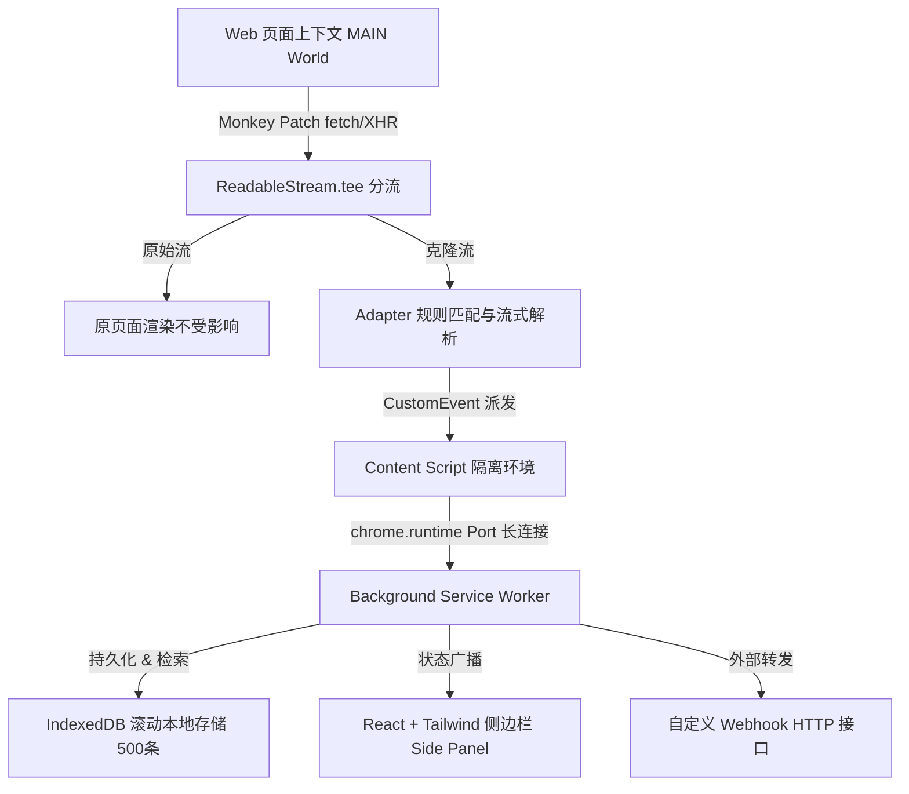
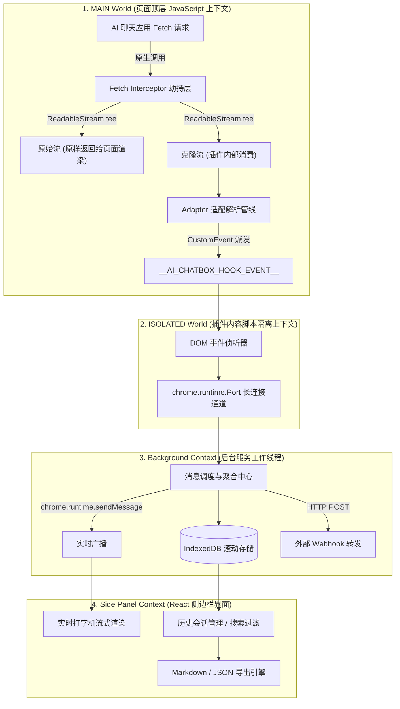

# AI Chatbox Hook & Stream Inspector 架构设计文档

本文档详细描述了 **AI Chatbox Hook & Stream Inspector** 浏览器扩展的设计理念、技术选型、分层架构、核心流式拦截原理、跨上下文通信机制以及数据持久化与导出流程。

---

## 1. 系统架构全景图

整个系统遵循 Chrome 扩展 **Manifest V3** 规范，采用清晰的四层分层架构：





---

## 2. 核心技术选型

| 维度 | 选型 | 决策原因 |
| :--- | :--- | :--- |
| **扩展开发框架** | **WXT** (Next-gen Web Extension Framework) | 原生支持 Manifest V3，原生支持配置 `world: 'MAIN'` content scripts，零配置 Vite 构建与 TypeScript 类型检查。 |
| **语言与运行时** | **TypeScript + ESNext** | 全静态类型定义（请求上下文、适配器接口、事件载荷、数据库 Schema），提供极致重构安全性。 |
| **拦截与分流** | **`ReadableStream.prototype.tee()`** | 零侵入、零阻塞。克隆独立分支给插件异步消费，保证页面原本的打字机渲染不受插件解析延迟或异常影响。 |
| **前端 UI 体系** | **React 19 + Tailwind CSS + Lucide Icons** | 成熟生态，轻松应对流式增量 DOM 渲染、状态管理、折叠树与代码块高亮。 |
| **存储层** | **IndexedDB (`idb` 库封装)** | 支持大数据量、结构化索引与大文本持久化，结合游标算法实现 500 条滚动容量管理。 |

---

## 3. 核心机制详解

### 3.1 MAIN World 双重 Content Script 注入

Manifest V3 严格限制了 Content Script 的执行环境：
- **ISOLATED World** 拥有完整的 `chrome.*` API 访问权，但无法访问宿主页面的 `window.fetch` 或 JS 变量。
- **MAIN World** 可以直接访问并代理页面的 `window.fetch`，但无法访问 `chrome.*` 扩展 API。

**工程解决方案**：
在 `manifest.json` 中声明两套 Content Script：
1. `injected.content.ts` (`world: 'MAIN'`)：在 `document_start` 最早时机执行，挂载拦截器。
2. `content.ts` (`world: 'ISOLATED'`)：建立与 Background 的 Port 通信，并监听 MAIN 发出的 `CustomEvent`。

```json
"content_scripts": [
  {
    "matches": ["<all_urls>"],
    "run_at": "document_start",
    "js": ["content-scripts/content.js"]
  },
  {
    "matches": ["<all_urls>"],
    "run_at": "document_start",
    "js": ["content-scripts/injected.js"],
    "world": "MAIN"
  }
]
```

---

### 3.2 无损流式分流拦截 (Tee Stream)

在 `src/interceptor.ts` 中劫持 `window.fetch` 的处理流程：

```ts
// 1. 提取请求体的 Prompt 和 Model 信息
const { prompts, model } = adapter.extractPrompt(adapterContext);

// 2. 发起原生网络请求
const response = await originalFetch.apply(this, [input, init]);

// 3. 将 response.body 分离为两个平行的可读流
const [streamForPage, streamForHook] = response.body.tee();

// 4. 插件在后台消费 streamForHook，逐步解码并解析 SSE chunks
consumeStreamAsync(streamForHook, adapter, requestId);

// 5. 将 streamForPage 包装为新 Response 立即返回给页面
return new Response(streamForPage, {
  status: response.status,
  statusText: response.statusText,
  headers: response.headers
});
```

**核心优势**：
- **零延迟**：不等待整个请求下载完毕才处理；
- **防背压阻塞**：`streamForPage` 和 `streamForHook` 互相独立，即使插件解析报错，页面通信也不会被挂起或抛错。

---

### 3.3 插件化适配器体系 (Adapter Pipeline)

所有平台适配器继承自统一的 `AIAdapter` 规范：

```ts
export interface AIAdapter {
  platform: PlatformType;
  match(ctx: AdapterContext): boolean;
  extractPrompt(ctx: AdapterContext): { prompts: PromptMessage[]; model?: string };
  parseStreamChunk(chunk: string, accumulated: string): StreamParseResult;
}
```

#### 当前已内置适配器：
1. **ChatGPT** (`chatgpt.com` / `chat.openai.com`)：
   - 提取：`backend-api/conversation` 请求载荷中的 `messages.content.parts`。
   - 解析：SSE 数据帧 `data: {"message": {"content": {"parts": [...]}}}`。
2. **Claude** (`claude.ai`)：
   - 提取：`chat_conversations` 请求载荷。
   - 解析：`content_block_delta` 与 `completion` 文本帧。
3. **DeepSeek** (`chat.deepseek.com`)：
   - 提取：标准 prompt/messages 字段。
   - 解析：SSE 流式增量 `choices[0].delta.content`。
4. **Kimi** (`kimi.moonshot.cn`)：
   - 提取：`messages` 列表。
   - 解析：`event: cmpl` 与 `json.text` 流式帧。
5. **通义千问** (`tongyi.aliyun.com` / DashScope)：
  - 提取：`messages`、`input.prompt` 或 `prompt`。
  - 解析：`output.text`、`output.choices[].delta.content` 与兼容 OpenAI 的响应结构。
6. **OpenAI Generic** (`/v1/chat/completions`)：
   - 适配各类开源/自建 WebUI（如 NextChat、LibreChat、LobeChat 等）。
7. **Generic Raw Fallback**：
   - 兜底捕获所有未知 AI 站点的请求体与流式文本，保证数据绝不丢失。

---

### 3.4 跨层通信机制 (IPC Bridge)

数据由底层到展示层经过三级接力：

```text
[MAIN World]
    │  1. CustomEvent (__AI_CHATBOX_HOOK_EVENT__)
    ▼
[ISOLATED Content Script]
    │  2. chrome.runtime.Port (AI_HOOK_PORT 长连接)
    ▼
[Background Service Worker]
    │  3. chrome.runtime.sendMessage (广播事件) + IndexedDB (持久化)
    ▼
[Side Panel UI (React)]
```

- **高频 Delta 缓冲**：在流式传输过程中，Background 维护内存态 `activeSessions` Map，流结束 (`AI_HOOK_END`) 后一次性落盘 IndexedDB，避免高频 DB 事务影响性能。

---

### 3.5 数据存储与生命周期管理

- **存储引擎**：基于 `idb` 封装的 IndexedDB 实例 `ai_chatbox_hook_db`。
- **容量控制**：设置最大存储阈值（默认 500 条）。新记录写入时若超出阈值，自动通过游标（Cursor）按时间戳升序删除最旧记录，防止存储空间无限增长。
- **导出能力**：
  - **Markdown 导出**：自动生成结构化对话文档，包含 Prompt、Role、Model、时间戳与完整回答。
  - **JSON 导出**：导出包含 URL、Request Payload、完整元数据的原始 JSON 结构。
- **Webhook 转发**：支持在 UI 设置中配置 Webhook 地址，流式响应完成后自动向目标地址发起 HTTP POST 同步推送。

---

## 4. 目录与模块结构

```text
c:/Code/hook/
├── docs/                       # 架构与开发文档
│   └── ARCHITECTURE.md
├── src/
│   ├── entrypoints/            # 扩展各个独立上下文入口
│   │   ├── background.ts       # Service Worker 后台线程
│   │   ├── content.ts          # ISOLATED World 内容脚本
│   │   ├── injected.content.ts # MAIN World 拦截脚本 (world: 'MAIN')
│   │   └── sidepanel/          # 侧边栏界面 (React + Tailwind CSS)
│   │       ├── App.tsx
│   │       ├── index.html
│   │       └── main.tsx
│   ├── interceptor.ts          # window.fetch & ReadableStream 分流拦截核心
│   ├── parsers/                # 各 AI 平台的解析器适配器
│   │   ├── base.ts             # 适配器抽象基类与 SSE 工具函数
│   │   ├── chatgpt.ts          # ChatGPT 专用适配器
│   │   ├── claude.ts           # Claude 专用适配器
│   │   ├── deepseek.ts         # DeepSeek 专用适配器
│   │   ├── kimi.ts             # Kimi 专用适配器
│   │   ├── openai-generic.ts   # 通用 OpenAI 规范适配器
│   │   ├── generic-raw.ts      # 未知平台保底适配器
│   │   └── index.ts
│   ├── types/                  # 全局 TypeScript 类型定义
│   │   └── index.ts
│   ├── utils/                  # 通用工具库
│   │   ├── export.ts           # Markdown / JSON 导出功能
│   │   └── storage.ts          # IndexedDB 滚动存储封装
│   └── styles.css              # Tailwind CSS 样式
├── wxt.config.ts               # WXT 框架配置文件
├── tsconfig.json               # TypeScript 编译配置
└── package.json                # 项目依赖与构建脚本
```

---

## 5. 安全性与可靠性考量

1. **页面功能绝对隔离**：分流采用 `stream.tee()`，即使插件脚本出现未捕获异常，宿主页面的正常请求与渲染不会受到任何阻塞。
2. **CSP (Content Security Policy) 免疫**：采用 WXT 原生 `world: 'MAIN'` 注入机制，避免了传统动态注入 `<script>` 标签受页面 strict CSP `script-src` 阻断的问题。
3. **内存泄漏防护**：所有分流 `reader` 使用完毕后在 `finally` 块中显式执行 `reader.releaseLock()`。
