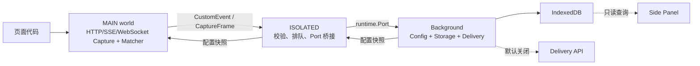
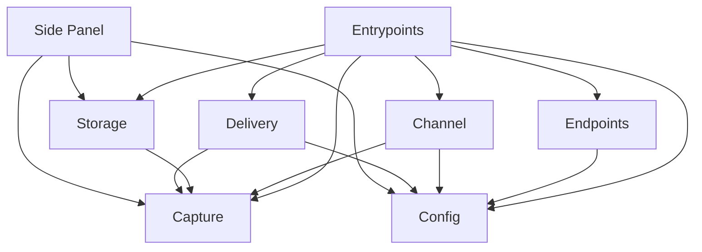

# 系统架构总览

本文只描述跨模块的系统决策。模块内部接口、状态机、失败策略和测试要求由各模块设计文档负责。当前源码已建立 v1 Capture 架构；已验证范围与剩余验收见 [structure.md](structure.md#实现一致性状态)。

源码布局与迁移清单见 [structure.md](structure.md)。

## 目标与范围

扩展在 Chrome MV3 中采集命中有效 endpoint 规则的 HTTP/1.x、HTTP/2、HTTP/3、SSE 和 WebSocket 应用层数据，并写入本机 IndexedDB。

- 从页面可观测的 HTTP 报文语义出发，保存 method、URL、status、Headers 和 opaque Body bytes。
- 不识别厂商，不解析 JSON、表单或二进制业务协议，不还原对话。
- 普通往返保存一条请求 Capture 和一条响应 Capture；SSE 保存 stream-open、各 event 和 stream-close；WebSocket 保存 open、双向 message、error 和 close。
- Config 管理所有模块运行参数；当前完整 SystemConfig 随扩展发布，未来通过同一 `ConfigSource` 接口切换到服务端。
- Capture 安装后按 SystemConfig 自动启用；delivery 受独立本地授权控制，远端配置不能开启用户未授权的外发。
- Side Panel 存在于开发和生产构建，点击扩展图标打开只读抓取列表。
- 文本型 XHR SSE 以 `decoded-text-projection` fidelity 采集，原生 EventSource 以 `message-event-projection` fidelity 采集；浏览器不暴露的原始字节必须明确标记，不能冒充完整原文。
- v1 不支持 Firefox，不自动脱敏或删除已完成数据。

## 运行上下文

- **MAIN world**：代理页面 fetch、XHR、EventSource 和 WebSocket，匹配 endpoint，产生 CaptureFrame。
- **ISOLATED world**：验证跨世界数据，维护有界队列和 Port 重连，不处理业务语义。
- **Background**：加载配置、摄入帧、管理 IndexedDB，并按条件调度 delivery。
- **Side Panel**：直接通过只读 `CaptureReader` 查询 IndexedDB，不经过 Background UI 消息。

## 核心概念

### Capture

`Capture` 是一条已完成的 HTTP 报文/错误终态、SSE 生命周期记录或 WebSocket 生命周期记录。HTTP 使用 `exchangeId`，SSE 使用 `streamId`，WebSocket 使用 `connectionId` 关联同一交互；Fetch/XHR SSE 还通过 `exchangeId` 关联发起请求。

Body 具有三个明确状态：

- `absent`：报文没有 Body。
- `captured`：字节已捕获，以 Base64 和解码后 `byteLength` 表示。
- `unavailable`：报文存在或可能存在 Body，但浏览器 API 无法读取或超过本地硬上限。

Headers 使用二元组列表而非对象，保留重复字段的表达能力。详细模型见 [Capture 模块设计](capture/capture-design.md)。

### CaptureFrame

`CaptureFrame` 是带 `protocolVersion`、`captureId` 和连续 `frameSequence` 的封闭跨上下文协议，正常生命周期为 `start → chunk* → end`。读取或容量问题可在 `end` 前发送 `body-unavailable`，让 Storage 删除 Body chunks 但保留报文元数据；协议无效时使用 `error` 放弃整条记录。Body chunk 使用 Base64，以兼容 Chrome runtime messaging 的 JSON 序列化。Frame 不是落盘业务模型；Storage 以 `(captureId, frameSequence)` 幂等摄入，只向读取者暴露已完成 Capture。

### SystemConfig

`SystemConfig` 是经过运行时校验的完整、不可变配置快照，覆盖 Capture、Endpoint、Channel、Storage、Delivery、Debug UI 和 Observability。Endpoint 按逻辑规则组织多个精确 host，每个 host 拥有多个显式 path match；同一命中规则同时适用于 request 和 response。各运行上下文只接收最小配置投影；Background 内一次替换同 revision 投影，跨上下文通过完整 envelope、ACK 和重试最终收敛。配置更新不能改变已经开始或已经排队的 HTTP exchange、SSE stream 或 WebSocket connection。

## 端到端数据流

### 普通 HTTP/HTTPS

1. Background 加载并发布有效配置；无有效配置时白名单为空。
2. MAIN 使用当前快照创建的 matcher 判断 URL，未命中则完全旁路。
3. 命中后固定 `exchangeId`、规则 ID 和配置 revision。
4. 请求报文和响应报文分别产生 Frame 序列。
5. ISOLATED 校验并转发，Background 将 Frame 原子最终化到 IndexedDB。
6. Side Panel 只读取完成记录；Delivery 在配置与本地授权均启用时读取 pending 记录。

### SSE

Fetch/XHR SSE 由响应 `Content-Type: text/event-stream` 识别。Fetch 及二进制 XHR 保存原始 event bytes；文本型 XHR 保存浏览器解码后的文本投影；原生 EventSource 只能保存 MessageEvent 投影。三者都产生 stream-open、event 和 stream-close，并通过 fidelity 明确完整度。

### WebSocket

WebSocket adapter 保存连接建立、双向 text/binary message、error 和 close。浏览器未暴露的握手响应、ping/pong、wire frame、masking 和压缩前字节明确标记 unavailable。

## 模块边界

- `config/` 不依赖其他业务模块。
- `capture/` 不依赖 Config、Endpoints、Channel、Storage、Delivery 或 UI；matcher 与 sender 通过函数注入。
- `endpoints/` 只依赖有效配置模型。
- `channel/` 不依赖 Storage、Delivery 或 UI。
- `storage/` 不依赖 Config、Channel、Delivery 或 UI。
- `delivery/` 拥有自己的 Queue 与 Transport 接口，不依赖 Storage 实现。
- Side Panel 只能单向依赖 Capture 类型、Storage 的只读接口和 Config 的只读 DebugUiConfig store。
- Entry Points 只组装依赖，不实现匹配、解析、事务或 DTO 映射。

## 跨模块约束

- **页面透明**：扩展故障不能改变页面请求参数、响应内容、异常类型或流消费行为。
- **信任边界**：配置输入、CustomEvent 和 runtime Port 消息都以 `unknown` 进入运行时校验。
- **报文原文**：Body 是 opaque bytes；`Content-Type` 只用于 SSE framing 和可选 UI 文本预览。
- **协议诚实性**：HTTP 版本和 EventSource/WebSocket 不可观测字段允许 unknown/unavailable，禁止推测或伪造完整性。
- **配置一致性**：请求开始时固定匹配结果和 revision；配置失败不覆盖仍有效的快照，跨上下文不发送可混合的字段级 patch。
- **持久化完整性**：只有合法 `end` 才产生可查询 Capture；乱序、缺块或 `error` 不产生部分记录。
- **重试语义**：Channel 可重发 Frame，Storage 必须幂等；Delivery 使用至少一次交付，服务端必须去重。
- **最小权限 UI**：Side Panel 除经用户确认的全量本地清理外只读；不能修改单条 Capture、配置或 delivery 状态。
- **启用控制**：Capture 由有效 SystemConfig 控制且安装后无需用户操作；远端配置不能绕过 LocalConsent 开启 delivery。
- **容量保护**：Capture 限制单体 Body/Event/Exchange，Channel 的 8 MiB 只限制 Port 断线待发送队列，在线 Frame 可持续转发，Storage 设置提醒与硬水位；任何超限都不得影响页面网络流。

## 浏览器可观测边界

这里的“HTTP 报文”不是 wire-level 抓包。fetch/XHR 无法保证提供：

- HTTP 版本、原始 request/status line。
- Header 原始大小写、线上顺序以及浏览器隐藏的 `Cookie`、部分 `Set-Cookie`。
- 压缩前 Body、HTTP/2 frame 或 chunked transfer framing。
- 浏览器序列化后的所有 XHR `FormData` 字节。
- 重定向链中的每一条中间报文。

真正的网络层原始报文需要 Chrome DevTools Protocol、`chrome.debugger` 或本机代理，会引入不同权限与产品约束，不属于当前方案。

原生 EventSource 还无法提供 response status/Headers、原始 event 行、`retry:` 指令和可靠的永久停止重连事件，因此只能保存明确标注的 MessageEvent 投影。WebSocket API 无法提供握手状态/Headers、重定向、ping/pong 或 wire frame；open 前失败只能记录 `phase: connecting` 与浏览器未给出原因，不能用于完整重放握手。

## 安全与构建

- Capture 可能包含 Authorization、请求 Body 和业务敏感数据；v1 不脱敏、不截断。
- 数据默认仅保存在本机 IndexedDB，但拥有本机或 DevTools 权限的人仍可能读取。
- 开发和生产构建都包含 Side Panel；生产 Manifest 必须声明 `side_panel` 与 `sidePanel` 权限。
- CI 必须断言生产产物包含 Side Panel HTML、CSS、JS，并可由扩展图标打开。
- 配置服务和 delivery endpoint 必须使用 HTTPS；允许的 origin 由构建时 bootstrap 固定。
- v1 默认限制为 64 KiB/Frame、16 MiB/普通 Body、1 MiB/SSE event、64 MiB/SSE exchange、8 MiB/Channel 断线队列、384/512 MiB Storage 提醒/硬水位。

当前 CustomEvent 接收端能拒绝畸形和超限配置，但 schema 校验不等于来源认证。页面仍可能构造结构合法的 MAIN 配置事件；在建立浏览器保证的不可伪造控制通道前，不能宣称 LocalConsent 到 MAIN 的控制面已完成安全闭环。

## 模块设计索引

| 模块 | 设计文档 | 负责内容 |
| :--- | :--- | :--- |
| Capture | [capture-design.md](capture/capture-design.md) | 报文模型、fetch/XHR 代理、SSE framing |
| Config | [config-design.md](config/config-design.md) | 配置契约、校验、快照生命周期与来源替换 |
| Endpoints | [endpoints-design.md](endpoints/endpoints-design.md) | URL 规范化、规则编译与匹配 |
| Channel | [channel-design.md](channel/channel-design.md) | 跨上下文消息、校验、排队与重连 |
| Storage | [storage-design.md](storage/storage-design.md) | IndexedDB schema、草稿、最终化与查询 |
| Delivery | [delivery-design.md](delivery/delivery-design.md) | 外部 DTO、批次、传输与确认 |
| Entry Points | [entrypoints-design.md](entrypoints/entrypoints-design.md) | 运行时组装、Side Panel 与生产构建 |

## 迁移顺序

1. 建立多协议 Capture、CaptureFrame、SystemConfig 及运行时校验。
2. 实现 Config、Endpoint Matcher、HTTP/SSE/EventSource/WebSocket Capture。
3. 实现 Channel 与 Capture Store，并验证重连、幂等和 Service Worker 恢复。
4. 将三个核心入口切换到新模块，删除旧 Session 和厂商解析路径。
5. 将 Side Panel 缩减为只读报文检查器，并纳入生产构建。
6. Delivery 已按独立 v1 DTO 实现并默认关闭；后续实现 HTTP ConfigSource 与最后有效快照缓存。