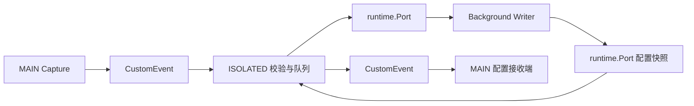

# Channel 模块设计

本文描述 `src/channel/` 的跨运行上下文通信设计。系统级约束见 [architecture.md](../architecture.md)，文件位置见 [structure.md](../structure.md)。

## 目标

Channel 模块连接页面 MAIN world、ISOLATED Content Script 和 Background Service Worker。它可靠地传输 `CaptureFrame` 与按上下文裁剪的配置投影，同时把每个上下文边界视为不可信输入边界。

## 边界

模块负责：

- MAIN 通过固定名称的 `CustomEvent` 发布 CaptureFrame。
- ISOLATED 校验事件、维护 `runtime.Port`、排队和重连。
- Background 向 ISOLATED 发布 `IsolatedChannelConfig` 和 `MainCaptureConfig`；ISOLATED 应用前者，只把后者转发到 MAIN。
- 约束消息 envelope、版本、大小和 Chrome runtime 可 JSON 序列化字段。

模块不负责 HTTP/SSE 解析、Capture 最终化、配置业务校验、IndexedDB 或 delivery。

## 文件

| 文件 | 设计职责 |
| :--- | :--- |
| `main-capture-channel.ts` | MAIN 侧 CaptureFrame sender 与事件 envelope |
| `isolated-channel.ts` | 双向桥、Port 生命周期、有界队列和重发 |
| `config-channel.ts` | Background Port 完整 envelope、MAIN 最小 envelope 的校验，以及 MAIN 接收端 |

实现可在文件内定义私有 envelope 类型，但不建立包罗所有消息的全局消息总线。

## 通信路径



Capture 与 Config 使用不同的 envelope `kind` 和独立解析器，避免一个宽松联合协议扩大攻击面。

## 公开接口

```ts
interface CaptureSender {
  send(frame: CaptureFrame): void;
}

function createMainCaptureSender(target: EventTarget): CaptureSender;

function installIsolatedChannel(options: {
  connect(): RuntimePort;
  eventTarget: EventTarget;
}): () => void;
```

`options` 在生产组装中可省略并使用 Chrome runtime 与 `window`。事件名和 Port 名称作为 Channel 内部协议常量导出给同级实现与测试，不属于业务模块配置接口。

## 队列与重连

- ISOLATED 在 Port 不可用时按接收顺序暂存已校验帧。
- Port 可用时 Frame 直接转发，不要求先完整缓存在 ISOLATED，因此 16 MiB HTTP Body 可以由多个 Frame 持续通过；8 MiB 限制仅约束 Port 断开或重连期间的待发送内存队列。
- 队列溢出条件为 `queuedFrameCount >= 512 OR queuedBodyBytes + incomingBodyBytes > 8 MiB`，任一条件先满足即拒绝新的 Body chunk。
- `queuedBodyBytes` 只累计 chunk 的 Base64 解码后字节，不包含 envelope、descriptor 或控制帧；实现另为 start、body-unavailable、end、error 等控制帧预留 64 KiB 序列化空间。
- 单个 Frame 解码后最多 64 KiB；Base64 格式和 `byteLength` 在入队前校验。
- 达到上限后终止最旧未完成 Capture 的整个帧组，并保留一条 `channel-overflow` error；禁止只删除中间 chunk 后继续发送。
- 断开后按有上限的退避策略重连，不使用无限快速循环。
- 重连后按原顺序重发；Background Store 必须对重复帧幂等。
- 页面卸载时尽力发送剩余帧，但 v1 不承诺跨页面生命周期持久化队列。

队列限制按解码后 Body 字节计量，防止 Base64 长度差异扰乱策略。它保护的是扩展自身内存，不构成可靠持久化；页面关闭、扩展更新或队列溢出仍可能丢失尚未进入 Background 的 Capture，并必须产生有限的诊断日志。

## 配置 revision 切换

- Background 每次发送一个同时包含 `MainCaptureConfig` 与 `IsolatedChannelConfig` 的完整 revision envelope，不分别发送可组合的 patch。
- ISOLATED 先完整校验 envelope，再把 MAIN 投影转发给 MAIN。MAIN 安装不可变快照并返回 revision ACK 后，ISOLATED 才切换自己的 ChannelPolicy，并向 Background ACK。
- 跨上下文切换不声称在同一时钟瞬间发生。其一致性来自每个 Capture 在 start 时固定 `configRevision`，且 Background 同时接受当前 revision 与仍在飞行的旧 revision。
- 已入队 Frame 保留入队时的 revision、顺序和有效性，配置更新不得重新解释、改写或删除它。新限制更小时不追溯驱逐旧队列，但在队列回落到新上限前只允许终止控制帧入队。
- ACK 超时或转发失败时，Background 保留该上下文最后确认的 revision 并重试完整 envelope；不得发送下一 revision 的局部投影。
- Background 只有收到 ACK 后才把该 tab/frame 标记为新 revision 已激活。旧交互可按其固定 revision 正常结束，revision 只用于关联和诊断，不作为 Storage 拒绝旧帧的条件。

## 不变量

- 每次跨世界接收都重新解析 `unknown`，不能信任 TypeScript 类型。
- Channel 只传输来自同一 SystemConfig revision 的完整投影，不传增量 patch，也不把完整 SystemConfig 暴露给页面上下文。
- Channel 不修改 Frame sequence、captureId 或配置 revision。
- Body chunk 使用带 `byteLength` 的 Base64 字符串；消息只包含 Chrome runtime 可 JSON 序列化数据。
- 卸载函数移除监听器、断开 Port 并停止重连。

## 失败策略

- 非法、超限或未知版本消息直接拒绝并记录有限诊断信息。
- 页面伪造的 CustomEvent 不能绕过 CaptureFrame 校验。
- 单条消息处理失败不能阻断后续消息。
- Background 不可用时保留有界队列；队列溢出必须可观测。
- 配置转发失败不改变 MAIN 已持有的有效快照。

## 测试

- 合法与非法 envelope、Base64/byteLength 一致性、大小限制和未知版本。
- Port 断开、重连、顺序重发和重复帧。
- Frame 数量、字节和控制帧预留上限；溢出按完整 Capture 终止，不制造孤立 chunk。
- 配置快照从 Background 到 MAIN 的完整传输、revision ACK、超时重试和旧队列保留。
- 重复安装与卸载不泄漏监听器或重连任务。