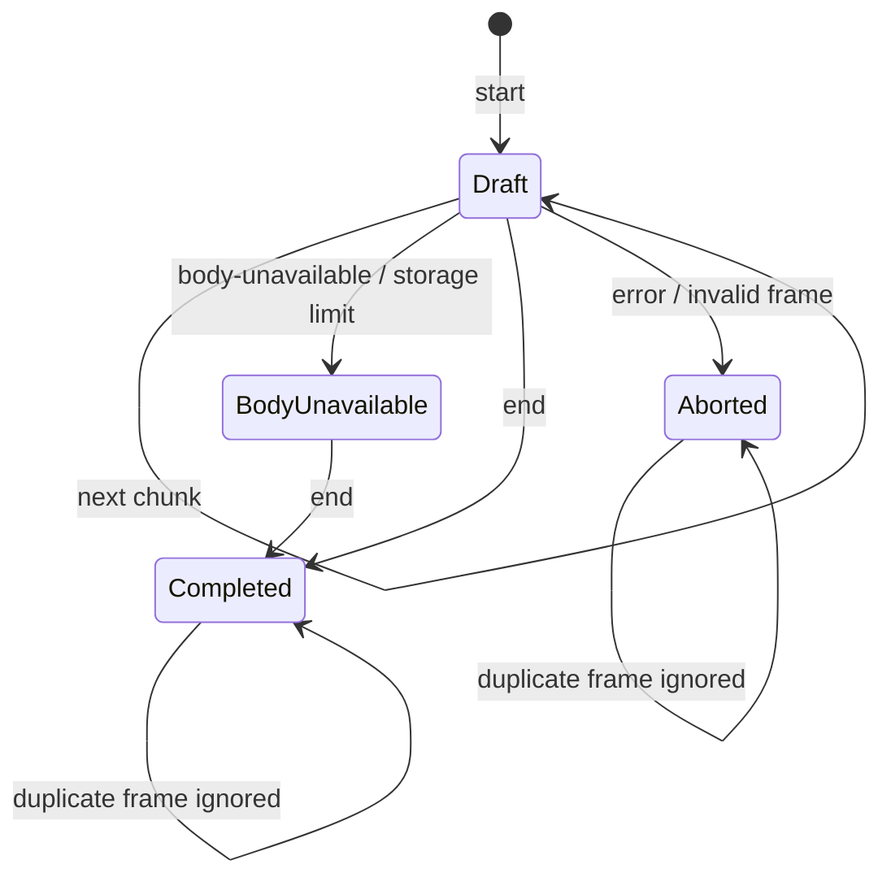

# Storage 模块设计

本文描述 `src/storage/` 的 IndexedDB 持久化设计。系统级约束见 [architecture.md](../architecture.md)，文件位置见 [structure.md](../structure.md)。

## 目标

Storage 模块是 IndexedDB 的唯一所有者。它把可能跨 Service Worker 生命周期到达的 `CaptureFrame` 原子最终化为可查询的 HTTP 报文 Capture，并维护 delivery 状态。

## 边界

模块负责 schema、迁移、事务、草稿恢复、Frame 幂等、完成记录查询和推送确认。模块不捕获网络，不解析或转码 Body，不生成 delivery DTO，也不向 UI 广播。

## 文件

| 文件 | 设计职责 |
| :--- | :--- |
| `capture-store.ts` | Frame 摄入状态机、查询视图和 delivery 队列操作 |
| `diagnostic-store.ts` | 通过 `chrome.storage.local` 有界保留跨模块运行诊断，供 Side Panel 只读查询 |
| `indexeddb-schema.ts` | 数据库名称、版本、object store、索引与升级事务 |

只有 `capture-store.ts` 和 `indexeddb-schema.ts` 可以直接导入 `idb` 或调用 `openDB`。

## 公开接口

```ts
interface CaptureWriter {
  ingest(frame: CaptureFrame): Promise<void>;
}

interface CaptureReader {
  listInteractions(query: InteractionQuery): Promise<Page<InteractionSummary>>;
  listCaptures(scope: InteractionScope): Promise<CaptureSummary[]>;
  getById(captureId: string): Promise<Capture | null>;
  getCapacityStatus(): Promise<CapacityStatus>;
}

interface CaptureCleaner {
  clear(): Promise<void>;
}

interface CaptureStore extends CaptureWriter, CaptureReader, CaptureCleaner {
  listPending(limit: number): Promise<Capture[]>;
  markDelivered(captureIds: string[]): Promise<void>;
  cleanup(): Promise<void>;
}

interface CapacityStatus {
  logicalBytes: number;
  warningBytes: number;
  hardLimitBytes: number;
  level: 'normal' | 'warning' | 'full';
  browserUsageBytes: number | null;
  browserQuotaBytes: number | null;
}

function createCaptureStore(options: StoreOptions): CaptureStore;
```

Background 只持有 `CaptureWriter`，Side Panel 持有 `CaptureReader & CaptureCleaner`。列表接口只返回摘要，完整 Headers 和 Body 仅在 `getById` 时读取，避免 UI 一次加载所有 Base64 数据。`clear()` 在单一事务内清空 Capture、chunks、drafts 和 tombstones，并把容量计数归零。Delivery 通过自己拥有的 `DeliveryQueue` 结构类型消费队列方法。

## 数据模型

| Object store | 内容 | 关键索引 |
| :--- | :--- | :--- |
| `captures` | 已完成报文/消息元数据、Headers、Body 状态与 delivery 状态 | `capturedAt`、`interactionId`、`exchangeId`、`streamId`、`connectionId`、`kind`、`deliveryState` |
| `captureChunks` | 已捕获 Body 的原始字节分片 | `[captureId, sequence]` |
| `captureDrafts` | descriptor、下一个 sequence 和更新时间 | `updatedAt` |
| `captureTombstones` | 已完成或终止 ID 的末帧摘要与过期时间 | `expiresAt` |
| `storageMetadata` | 跨 Capture 事务共享的逻辑占用计数 | `key` |

Channel 的 Base64 chunk 在写入时校验并解码为 `ArrayBuffer`，避免 IndexedDB 长期承担 Base64 体积膨胀。Reader 必须按序拼接字节，再以领域模型规定的 Base64 形式返回 `MessageBody`。`absent` 和 `unavailable` 不创建 Body chunks；草稿永远不出现在 Reader 结果中。

## 摄入状态机



- 每帧的重放键是 `(captureId, frameSequence)`；草稿保存下一个 `frameSequence`、下一个 `chunkSequence` 以及每个已接收帧的稳定内容摘要。
- `start` 必须使用 `frameSequence: 0`。同键且内容摘要相同的重复 start 是幂等操作；同键但内容不同是协议冲突，终止草稿并写 tombstone。
- 新帧的 `frameSequence` 必须等于草稿保存的下一个值。小于该值且摘要相同视为重放并忽略；小于该值但摘要不同或大于该值均终止草稿。
- `chunkSequence` 必须等于草稿的下一个 chunk 序号，并与 CaptureFrame 的 `frameSequence` 分别校验。
- `body-unavailable` 删除已有 chunks，保留 descriptor 和原因；后续 chunk 被忽略，等待 `end` 完成元数据记录。
- `end` 在单一读写事务中验证草稿、写完成元数据并删除草稿。
- `error` 删除草稿及其 chunks，不创建 Capture。
- 已完成或终止的 captureId 保存带 TTL 的 tombstone 及最后帧摘要，确保重复 end/error 幂等并防止重连重发复活记录。tombstone TTL 不得短于 Channel 最大重连窗口与草稿 TTL。

## 事务与并发

- Store 实例用按 `captureId` 分片的 Promise 队列串行调用；任务结束后立即释放队列项，不能形成永久 Map。不同 ID 可并行。
- 每次 ingest 仍在单一 IndexedDB `readwrite` 事务中读取草稿当前序号、验证 Frame、写 chunk/完成记录并推进序号。IndexedDB 事务是跨异步任务和 Service Worker 重启后的最终并发边界，不能只依赖内存锁。
- 最终化和错误清理覆盖涉及的全部 object store，避免半完成记录。
- `markDelivered` 只更新当前仍为 pending 的指定 ID。
- `listPending` 按确定顺序返回，通常为 `capturedAt` 后接 `id`。
- 数据库升级只通过递增 schema version 完成，不在正常读写路径临时修复结构。

## 容量策略

Storage 以自身维护的逻辑占用量实施确定性限制，并辅以 `navigator.storage.estimate()` 观察浏览器配额：

| 水位 | 默认值 | 行为 |
| :--- | ---: | :--- |
| 提醒水位 | 384 MiB | 继续摄入，记录一次容量告警并供 Debug UI 展示 |
| 硬水位 | 512 MiB | 拒绝新的 `start`，已有草稿仅在不越过硬水位时继续 |

逻辑占用量至少包含 Body 原始字节、Capture 元数据和草稿；实现可以保守计量，但不能低估 Body。浏览器实际 quota 若更低，以浏览器限制为准。

- 任一 chunk 会使逻辑占用超过硬水位时，回滚该写入，删除对应 chunks，将草稿 Body 标记为 `unavailable: storage-limit`；后续 `end` 仍可完成报文元数据。
- 不自动删除已完成记录，也不以循环覆盖隐藏数据丢失。
- delivery 成功只标记 delivered，不立即删除；用户可在 Side Panel 明确确认后执行全量清理。
- 释放空间前，新的 Capture 保持拒绝状态；已有完成记录仍可查询和 delivery。
- 容量诊断不作为 Capture，不进入 delivery 队列。

## 不变量

- Reader 只返回已经收到合法 `end` 的记录。
- HTTP exchange、SSE stream 和 WebSocket connection 均可按各自关联 ID 查询完整生命周期；Fetch/XHR SSE 可通过 `exchangeId` 回查发起请求。
- 每个 chunk 在一个 Capture 内恰好出现一次且顺序连续。
- Storage 不依据 `Content-Type` 解析 Body，也不保存派生 JSON 对象或文本副本。
- `absent`、零字节 `captured` 和 `unavailable` 在落盘后保持可区分。
- 发送失败不改变 pending 状态。
- UI 不能修改单条记录或确认 delivery；唯一写操作是用户确认后的全量清理。

## 恢复与失败策略

- Store 打开时以及每次成功 ingest 后以限量批次清理超过 `draftTtlMs` 的孤立草稿、相关 chunks 和过期 tombstone；清理未完成时安排下一次 Background 唤醒继续，不能依赖 Service Worker 常驻定时器。
- IndexedDB 事务失败时整次 Frame 摄入回滚，调用方可重试。
- schema 升级失败时停止打开数据库并暴露诊断，不删除旧库。
- Body 还原发现缺块或字节长度不符时返回数据完整性错误，不返回伪造的部分 Capture。

## 测试

- absent、零字节、unavailable、单块和多块 Body 最终化。
- 重复 start/chunk/end、乱序和缺失 sequence。
- error 清理、孤立草稿恢复和 Service Worker 重启。
- 查询顺序、按 ID 读取和 Body 字节无损还原。
- pending 顺序、成功确认、失败保留和并发 flush 保护。
- schema 创建与每个版本迁移。
- 提醒/硬水位、事务回滚、重启后逻辑占用恢复和浏览器 quota 错误。