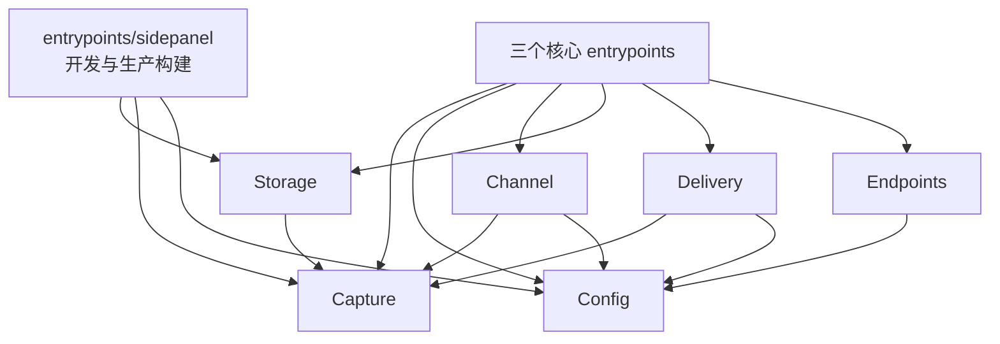

# 项目结构说明

本文将 [architecture.md](architecture.md) 的设计映射到源码。目录按稳定的业务能力组织；Chrome 生命周期组装集中在入口，浏览器 API adapter 留在拥有对应行为的模块中。

设计目标不是增加层数，而是让模块通过删除测试和替换测试：删除 Side Panel 不影响采集；本地配置换成 HTTP 不影响配置调用方；增加 WebSocket 不修改 HTTP；delivery JSON 改版不修改 Capture。

## 目录

```text
browser-extension/
├── .gitignore                      # Git 忽略规则
├── README.md                       # 项目目标、范围与启动方式
├── package-lock.json               # npm 依赖锁定
├── package.json                    # 依赖、开发命令与生产构建命令
├── tsconfig.json                   # TypeScript 严格模式与路径配置
├── wxt.config.ts                   # Chrome MV3、权限与入口过滤
├── docs/
│   ├── architecture.md             # 系统架构、数据流与可靠性决策
│   ├── structure.md                # 完整目录、依赖方向与迁移清单
│   ├── capture/
│   │   └── capture-design.md       # Capture 模型与 HTTP/SSE 采集设计
│   ├── config/
│   │   └── config-design.md        # 配置契约、加载与快照生命周期
│   ├── endpoints/
│   │   └── endpoints-design.md     # URL 规则编译与匹配设计
│   ├── channel/
│   │   └── channel-design.md       # 跨运行上下文通信设计
│   ├── storage/
│   │   └── storage-design.md       # IndexedDB、草稿与查询设计
│   ├── delivery/
│   │   └── delivery-design.md      # 批次契约与可靠推送设计
│   └── entrypoints/
│       └── entrypoints-design.md   # 入口组装与 Side Panel 边界设计
├── src/
│   ├── capture/
│   │   ├── capture.ts              # Capture 联合类型与领域约束
│   │   ├── capture-frame.ts        # CaptureFrame 类型与运行时校验
│   │   ├── capture-helpers.ts      # Capture 元数据、Header 与 Body 辅助逻辑
│   │   ├── bytes.ts                # Base64 和字节数组转换
│   │   ├── http-capture.ts         # 组合 fetch/XHR HTTP 与 SSE 采集
│   │   ├── fetch-adapter.ts        # fetch 代理与响应流复制
│   │   ├── xhr-adapter.ts          # XMLHttpRequest 代理
│   │   ├── sse-framer.ts           # SSE event 原文分帧
│   │   ├── event-source-adapter.ts # 原生 EventSource 有损投影
│   │   └── websocket-capture.ts    # WebSocket 生命周期与双向消息
│   ├── config/
│   │   ├── system-config.ts        # 完整 SystemConfig 与模块配置段
│   │   ├── config-contract.ts      # DTO 校验、默认值和映射
│   │   ├── config-source.ts        # 可替换的配置来源接口
│   │   ├── config-manager.ts       # 配置来源回退与 Background 快照替换
│   │   ├── config-projections.ts   # 各模块及运行上下文最小配置投影
│   │   ├── config-projection-store.ts # 扩展页只读投影存储
│   │   ├── safety-policy.ts        # 构建时硬上限与允许 origin
│   │   ├── local-consent.ts        # 用户控制的 delivery 本地授权
│   │   ├── bundled-config-source.ts# 当前 ConfigSource adapter
│   │   └── system-config.json      # 当前完整系统配置快照
│   ├── endpoints/
│   │   └── endpoint-matcher.ts     # URL 规范化、规则编译与匹配
│   ├── channel/
│   │   ├── main-capture-channel.ts # MAIN 通过 CustomEvent 发布帧
│   │   ├── isolated-channel.ts     # ISOLATED 排队与 Port 转发
│   │   └── config-channel.ts       # Background 到 MAIN 的配置快照
│   ├── storage/
│   │   ├── capture-store.ts        # 摄入、查询与队列确认
│   │   ├── diagnostic-store.ts     # 有界运行诊断的持久化与查询
│   │   └── indexeddb-schema.ts     # 数据库版本、store 和迁移
│   ├── delivery/
│   │   ├── delivery.ts             # 读取、组批、发送与确认
│   │   ├── delivery-contract.ts    # Capture 到版本化 JSON DTO
│   │   ├── client-context.ts       # 浏览器和扩展环境信息
│   │   └── http-delivery.ts        # HTTP 推送 adapter
│   └── entrypoints/
│       ├── injected.content.ts     # MAIN：安装采集与接收配置
│       ├── content.ts              # ISOLATED：双向消息桥
│       ├── background.ts           # Service Worker：后台组装入口
│       └── sidepanel/              # 开发与生产构建共用的只读检查 UI
│           ├── env.d.ts             # Side Panel CSS 模块声明
│           ├── index.html          # WXT Side Panel HTML 入口
│           ├── main.tsx            # React 挂载
│           ├── App.tsx             # 只读查询、页面状态与视图组合
│           └── styles.css          # Side Panel 独立样式
└── test/
    ├── capture/                   # Capture 协议、适配器与分帧测试
    │   ├── capture-frame.test.ts
    │   ├── capture-helpers.test.ts
    │   ├── event-source-adapter.test.ts
    │   ├── fetch-adapter.test.ts
    │   ├── sse-framer.test.ts
    │   ├── websocket-capture.test.ts
    │   └── xhr-adapter.test.ts
    ├── channel/
    │   └── channel.test.ts
    ├── config/
    │   └── config.test.ts
    ├── delivery/
    │   └── delivery.test.ts
    ├── endpoints/
    │   └── endpoint-matcher.test.ts
    ├── entrypoints/
    │   └── production-build.test.ts
    └── storage/
        ├── capture-store.test.ts
        ├── diagnostic-store.test.ts
        └── indexeddb-migration.test.ts
```

以上列出受版本控制的工程结构；`.git/`、`.wxt/`、`.output/` 和 `node_modules/` 是版本控制元数据或生成目录，不纳入源码结构。

不创建通用 `utils/`、`services/` 或 `adapters/` 顶级目录。辅助代码留在拥有它的模块中；只有出现第二个真实使用者时才提升为共享模块。
测试目录镜像生产模块边界；跨模块场景归属主要被测能力，入口构建约束归入 `test/entrypoints/`。

## 模块和文件职责

### `capture/`

拥有“什么是一条采集记录”和“如何从页面网络 API 产生记录”的完整能力。详细约束见 [Capture 模块设计](capture/capture-design.md)。

| 文件 | 职责 | 对外内容 |
| :--- | :--- | :--- |
| `capture.ts` | 定义 HTTP/1/2/3、SSE、WebSocket Capture，有序 Headers、opaque Body 和 fidelity | `Capture`、各联合成员类型 |
| `capture-frame.ts` | 定义 Base64 Body 分帧协议并校验不可信消息 | `CaptureFrame`、`parseCaptureFrame` |
| `capture-helpers.ts` | Capture ID、公共元数据、Headers 与 Body 安全读取 | capture 内部共享工具 |
| `bytes.ts` | Uint8Array、Base64 与字节拼接转换 | capture、storage 和 UI 使用的字节工具 |
| `http-capture.ts` | 组合四类 adapter，通过注入 matcher 和 policy 生成 CaptureFrame | `CapturePolicy`、`installCapture()` |
| `fetch-adapter.ts` | 保留原生 fetch 语义，复制请求和响应流；只由 `http-capture.ts` 组装 | 模块内部 adapter 接口，测试可直接调用 |
| `xhr-adapter.ts` | 保留 XHR 生命周期，读取可见请求与响应原文；只由 `http-capture.ts` 组装 | 模块内部 adapter 接口，测试可直接调用 |
| `sse-framer.ts` | 按 SSE 空行边界处理跨 chunk、LF/CRLF 和尾部不完整 event | `createSseFramer()`，供协议测试 |
| `event-source-adapter.ts` | 记录原生 EventSource 生命周期和 MessageEvent 投影，显式标注有损 fidelity | 模块内部 adapter 接口，测试可直接调用 |
| `websocket-capture.ts` | 记录 WebSocket open、双向消息、error 与 close | 模块内部 adapter 接口，测试可直接调用 |

`capture/` 不读取配置，也不依赖 `endpoints/`、Channel、IndexedDB、delivery 或 UI。MAIN entrypoint 注入 matcher、sender 和 Config 生成的 `CapturePolicy`；HTTP、SSE、EventSource 与 WebSocket adapter 共享 CaptureFrame，但状态机彼此独立。

### `config/`

拥有配置从不可信 JSON 到有效快照的完整生命周期。详细约束见 [Config 模块设计](config/config-design.md)。

| 文件 | 职责 | 对外内容 |
| :--- | :--- | :--- |
| `system-config.ts` | 定义完整系统配置与各模块配置段 | `SystemConfig`、`EndpointRule` |
| `config-contract.ts` | 校验所有模块配置、应用 SafetyPolicy 并映射有效快照 | `parseSystemConfig(input)` |
| `config-source.ts` | 定义配置来源接缝，不包含缓存或协议细节 | `ConfigSource.load(): Promise<unknown>` |
| `config-manager.ts` | 按来源顺序加载、回退到 safe-disabled、组合本地授权并替换 Background 快照 | `ConfigManager`、`createConfigManager(...)` |
| `config-projections.ts` | 从同一 revision 生成 MAIN、ISOLATED、Storage、Delivery、UI 和 Observability 投影 | `ConfigProjectionMap`、`createConfigProjections()` |
| `config-projection-store.ts` | 持久化无敏感信息的 DebugUiConfig，供扩展页只读加载 | `saveDebugUiConfig()`、`loadDebugUiConfig()` |
| `safety-policy.ts` | 构建时硬上限、允许配置与 delivery origin | `SafetyPolicy` |
| `local-consent.ts` | 读取用户对采集与 delivery 的本地授权，优先于远端配置 | `LocalConsentSource` |
| `bundled-config-source.ts` | 当前 adapter，读取随扩展发布的完整快照 | `BundledConfigSource` |
| `system-config.json` | 当前所有模块的完整配置，结构与未来 HTTP 响应一致 | 数据文件 |

后续新增 `http-config-source.ts` 和 `config-cache.ts`。替换仅发生在 `background.ts` 的组装代码，其他模块继续消费 Config 生成的最小投影。

### `endpoints/`

只有一个深模块 `endpoint-matcher.ts`。它规范化 URL、编译规则并按确定优先级匹配，公开 `createEndpointMatcher(config)`；返回的 matcher 只接受 URL 并返回规则 ID 和配置版本。它不读取配置来源、不访问网络，也不持有全局可变状态。详细约束见 [Endpoints 模块设计](endpoints/endpoints-design.md)。

### `channel/`

拥有 Chrome 三个运行上下文之间的消息传输，不拥有采集和配置业务规则。详细约束见 [Channel 模块设计](channel/channel-design.md)。

| 文件 | 职责 | 对外内容 |
| :--- | :--- | :--- |
| `main-capture-channel.ts` | 将 CaptureFrame 包装为固定名称的 CustomEvent | `createMainCaptureSender()` |
| `isolated-channel.ts` | 校验页面事件，维护 Port、待发队列、重连与有界重试 | `installIsolatedChannel()` |
| `config-channel.ts` | 校验 Background Port 完整 envelope 与 MAIN 最小 envelope，并安装 MAIN 接收端 | `parseConfigEnvelope()`、`parseMainConfigEnvelope()`、`installMainConfigReceiver()` |

所有跨上下文输入都必须重新校验。Channel 不解析 HTTP/SSE，不拼装 Capture，不访问存储。

### `storage/`

拥有 IndexedDB schema、事务、Capture 最终化和 delivery 队列状态。其他模块不得直接调用 `openDB`。详细约束见 [Storage 模块设计](storage/storage-design.md)。

| 文件 | 职责 | 对外内容 |
| :--- | :--- | :--- |
| `capture-store.ts` | 摄入 Frame、恢复/清理草稿、查询已完成记录、读取待推送批次、确认推送成功 | `CaptureWriter`、`CaptureReader` 与 `createCaptureStore()` |
| `diagnostic-store.ts` | 按 Observability 上限保留并读取 Channel、Storage、Config 与 Delivery 诊断 | `appendDiagnostic()`、`loadDiagnostics()` |
| `indexeddb-schema.ts` | 数据库名称、版本、object store、索引和升级函数 | 仅供 storage 内部使用 |

两个公开接口是针对真实调用方划分的能力视图，而不是两套实现：Background 使用 `CaptureWriter`，Side Panel 使用只读 `CaptureReader`。同一个 store 的待推送读取与确认方法同时以结构类型满足 delivery 自己定义的 `DeliveryQueue`。

### `delivery/`

负责把内部领域数据转换成外部 JSON 契约并可靠推送。详细约束见 [Delivery 模块设计](delivery/delivery-design.md)：

- `delivery.ts` 定义自己所需的 `DeliveryQueue` 和 `DeliveryTransport` 接口，编排读取、组批、发送与成功确认，对外只暴露 `flush()`。
- `delivery-contract.ts` 定义带 `schemaVersion` 的外部 DTO，并显式完成 `Capture → DeliveryCapture` 映射。
- `client-context.ts` 在组批时读取扩展版本、User-Agent、语言和平台等环境信息。
- `http-delivery.ts` 实现 `DeliveryTransport`，只处理 HTTP、鉴权、超时和成功判定。

Capture 是采集、存储与 delivery 共同使用的内部事实模型；Delivery DTO 是服务端 JSON 契约。禁止直接把 IndexedDB 记录 `JSON.stringify` 后作为长期协议，以免服务端格式变化迫使采集与存储一起修改。

`delivery.ts` 依赖接口而不依赖 IndexedDB 或 fetch 的具体实现。测试使用内存队列和假 Transport。

### `entrypoints/`

三个运行时入口只负责组装，完整的运行上下文与构建隔离规则见 [Entry Points 模块设计](entrypoints/entrypoints-design.md)：

- `injected.content.ts`：MAIN world，安装 HTTP Capture、Capture sender 和配置接收端。
- `content.ts`：ISOLATED world，安装 Frame 转发和配置中继。
- `background.ts`：创建 Config Manager、Capture Store 和 Delivery，连接 Port 与生命周期事件。

`sidepanel/` 是刻意保留的例外：为了满足“整目录删除 UI”，其 HTML、React、样式和组件全部共置。它直接使用 storage 暴露的 `CaptureReader`，不要求 Background 注册任何调试消息，不接收正文广播，也不修改 Capture、配置或 delivery 状态。

WXT 只扫描一个 `entrypointsDir`，因此 Side Panel 的 `index.html` 必须位于该目录下。开发命令构建全部入口；生产命令使用 WXT `filterEntrypoints` 显式构建 `background`、`content`、`injected` 和 `sidepanel`。Manifest 不手写 `side_panel`，由 WXT 根据实际参与构建的入口生成。

## 依赖方向



依赖只能沿箭头方向：

- `config/` 不依赖其他业务模块。
- `endpoints/` 只依赖配置模型。
- `capture/` 不依赖 Config、Endpoints、Channel、Storage、Delivery 或 Side Panel；外部能力通过函数注入。
- `channel/` 不依赖 Storage、Delivery 或 Side Panel。
- `storage/` 拥有 `StoragePolicy`，不依赖 Config、Channel、Delivery 或 Side Panel。
- `delivery/` 不依赖 Channel、Storage 实现或 Side Panel；依赖通过接口注入。
- 核心模块和三个核心入口都不得导入 `entrypoints/sidepanel/`。
- Side Panel 可以单向依赖 Capture 类型、Storage 的只读接口和 Config 的只读 DebugUiConfig store。

禁止用顶级 barrel 文件统一导出所有模块，避免无意形成循环依赖和把浏览器专属实现打入错误上下文。

## 关键公开接口

| 模块 | 接口 | 调用者 |
| :--- | :--- | :--- |
| Capture | `installCapture({ match, emit, policy }) → uninstall` | MAIN entrypoint |
| Config | `ConfigSource.load() → unknown` | Config Manager |
| Config | `ConfigManager.initialize/reload/current/subscribe` | Background entrypoint |
| Endpoints | `createEndpointMatcher(config) → match(url, protocol)` | MAIN entrypoint，结果函数注入 Capture |
| Channel | `send(frame)` / `install()` | 三个运行时入口 |
| Storage | `CaptureWriter.ingest(frame)` | Background entrypoint |
| Storage | `CaptureReader.listInteractions/listCaptures/getById/getCapacityStatus` | Side Panel |
| Storage | `CaptureStore.listPending/markDelivered/cleanup` | Delivery 与 Background entrypoint |
| Delivery | `DeliveryQueue.listPending/markDelivered` | Capture Store 以结构类型满足 |
| Delivery | `flush() → DeliveryResult` | Background entrypoint |

接口只暴露调用者完成任务所需的最小能力。具体类、IndexedDB 事务、DOM 事件名、Port 名称和 HTTP 请求细节均留在实现内部。

## 实现一致性状态

截至 2026-09-09，目录树、模块依赖、生产入口过滤和核心领域接口已与本文对齐。以下设计验收仍未完成，不能以当前单元测试代替：

| 未完成验收 | 当前状态 |
| :--- | :--- |
| 真实浏览器 fetch streaming、XHR responseType、EventSource 与 WebSocket echo | 尚无浏览器集成测试 |
| Background 初始化单飞、配置 ACK 重试、alarm 去重和 consent reload | 有实现，尚无入口级测试 |
| Side Panel 对全部 Capture kind 的摘要和详情渲染 | 有基础只读 UI，尚无渲染测试，部分设计摘要仍未展示 |
| Delivery timeout、HTTP redirect 和敏感日志约束 | 有超时与禁止重定向实现，尚无 transport 级测试 |
| Storage 全部乱序/缺块/tombstone 重放与 cleanup 续调度 | 已覆盖迁移、冲突、容量和并发，剩余状态尚未完整测试 |
| MAIN 配置消息来源认证 | 已有 exact-schema 校验和最小投影，但页面仍可伪造结构合法的 CustomEvent；尚未建立不可伪造的控制通道 |

本文的“测试”描述是验收要求；只有仓库测试或浏览器验证实际覆盖后，才能视为已验证。

## 扩展方式

### 配置切换为 HTTP

新增 `config/http-config-source.ts` 与 `config/config-cache.ts`，在 `background.ts` 将 `BundledConfigSource` 替换为带 bundled fallback 的 `HttpConfigSource`。其余模块继续消费相同投影。

### 扩展协议字段

新增协议只能扩展 `Capture` 联合类型和对应 adapter；Channel 继续传输 CaptureFrame，Storage 与 Delivery 通过联合类型穷尽检查处理新成员。

### 修改 Side Panel

Side Panel 是产品的数据查看入口。修改其查询和展示时不改变 Background 消息协议；删除该目录会使生产扩展失去抓取列表界面。

### 修改 delivery JSON

只修改 `delivery-contract.ts` 及其测试。Capture 和 IndexedDB schema 不随外部接口字段命名变化。

## 已完成的旧文件迁移

| 旧文件 | 处理方式 |
| :--- | :--- |
| `src/types.ts` | 拆入 `capture/capture.ts`、`capture/capture-frame.ts` 和 `config/system-config.ts` |
| `src/interceptor.ts` | 拆入 `capture/`，删除厂商解析与配置同步 |
| `src/parser/stream-parser.ts` | 删除，以只保留原文的 `sse-framer.ts` 替代 |
| `src/matcher/endpoint-matcher.ts` | 迁移到 `endpoints/`，改为接收有效配置快照并移除 Provider 语义 |
| `src/utils/storage.ts` | 由 `storage/capture-store.ts` 替代，取消按记录数量循环删除，改用逻辑字节水位 |
| `src/entrypoints/sidepanel/` | 原地缩减为完整、只读的数据检查 UI |
| `src/entrypoints/sidepanel/styles.css` | 移入 Side Panel，保持 UI 样式边界 |
| `wxt.config.ts` | 开发和生产构建均注册 Side Panel 权限和入口 |
| `package.json` | 生产构建显式包含四类入口；React/Tailwind 仅服务 Side Panel |

旧模块已由新调用路径接管，仓库中不再并存旧 Session 数据模型。

## 命名约束

- `Capture` 表示落盘业务记录；`CaptureFrame` 表示跨上下文传输片段；禁止继续使用 `Session`。
- 使用 `exchangeId` 关联同一次 HTTP 往返，使用 `captureId` 标识一条 Capture。
- 使用 `DeliveryBatch` 和 `DeliveryCapture` 表示外部 JSON 契约，不以 `Capture` 冒充远端 DTO。
- 使用 `SystemConfig` 表示所有模块共享的完整配置快照，模块运行时只消费最小投影。
- 使用 `ConfigSource` 表示配置来源；当前实现是 `BundledConfigSource`，后续实现是 `HttpConfigSource`。
- 使用 `revision` 标识配置版本；Capture 必须记录实际参与匹配的版本。
- `event` 在 SSE 语境中专指 SSE event；DOM 事件写作 `CustomEvent`。
- 不使用厂商名称作为模块、类型或分支条件。
